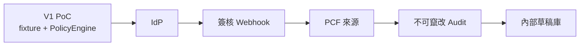

# Mandate — Threat Model and Gaps

**文件狀態**：V1（碳數據主線輕量更新）  
**範圍**：CBAM／嵌入排放 碳數據信任閘門 PoC；非完整產品安全認證  
**相關**：`TRUST_ARCHITECTURE.md`、`POLICY_SPEC.md`、`GOVERNANCE_GAP_MEMO.md`

---

## 1. 資產與攻擊面

| 資產 | 為何重要 | V1 保護 |
|------|----------|---------|
| Mandate 邊界（工具、供應商黑名單） | 被改等於被授權擴大 | 應用層政策；無密碼學封印 |
| PcfPayload／Staging | 假漂亮噸數入庫 = 合規風險 | `POL-CARB-001` 品質最低欄位 |
| Approval（CBAM 草稿核准） | 被偽造／重放 = 擅自寫入草稿 | 一次性 `consumedAt`；Agent 不可 commit |
| CbamDraft | 寫入即成組織內部「準申報」依據 | 僅 Human commit；非真 registry |
| `shareRevoked` 狀態 | 撤銷無效 = 繼續濫用數據 | `POL-REV-010` |
| AuditEvent | 事後究責 | 結構化 log；**可被本機竄改** |
| LLM 提示與工具提議 | 提示注入可誘使亂提議／要求 commit | 即使提議成功，仍須 PolicyEngine |

---

## 2. 威脅清單與緩解

| ID | 威脅 | 影響 | V1 緩解 | 殘餘風險 |
|----|------|------|---------|----------|
| T-01 | LLM 要求「直接 commit／申報」 | 未授權寫入草稿 | `commit_cbam_draft` 不在 Agent 工具表；`POL-GATE-000` | Runtime 被改碼可繞過 |
| T-02 | Agent 重放舊 Approval | 重複 commit | `POL-HITL-010` 消耗核准 | V1 stub 鎖可能不完整 |
| T-03 | 使用已撤銷 Mandate | 撤銷無效 | `POL-AUTH-001` | process 快取未 reload |
| T-04 | 使用已撤銷資料分享 | 繼續 submit／commit | `POL-REV-010`；Staging 標不可用 | 旁路直接改 store |
| T-05 | 漂亮噸數／缺欄假 PCF | 假數據入庫 | `POL-CARB-001` | 欄位齊全仍可能造假數值——V1 不做第三方驗證 |
| T-06 | Deny list 被 allow 覆寫 | 黑名單失效 | 評估序 step2 先於 step3 | 設定檔竄改 |
| T-07 | 竄改 Audit | 無法究責 | 無 | **高**：需 WORM／外送 |
| T-08 | 偽冒 Principal | 冒用買方 | fixture 對照 | **無真 IdP** |
| T-09 | 復活 REVOKED Mandate | 撤銷可逆 | `POL-REV-002` | 直接改 DB |
| T-10 | 敏感匯出 | 碳數據外洩 | Agent deny；Human HITL | V1 可能僅 UI |
| T-11 | supplierId 混淆 | 錯供應商入草稿 | 契約要求一致 | 未接真實 MDM |
| T-12 | 跨 org 存取 | 越權 | `orgId` 隔離 | 測試不足時可能漏查 |

---

## 3. 信任假設（V1）

1. 運行 PolicyEngine 的主機與程式碼完整。  
2. Human Approver 為真實授權人。  
3. Fixture PCF／供應商僅用於 Demo，不代表真實世界保證。  
4. `commit_cbam_draft` 成功僅寫入 **mock 草稿庫**，**無**官方 CBAM registry 副作用。  
5. 不做碳權／避險路徑，故無相關金融攻擊面納入本 PoC。

---

## 4. 已知缺口（對齊 Memo）

| 缺口 | 說明 | 對評審怎麼講 |
|------|------|--------------|
| 真 IdP | 無 OIDC／企業目錄 | 身份欄位已留 `authSource`；PoC 用 fixture |
| 真 PCF／第三方驗證 | 無獨立核證 | 品質閘只保證**欄位完備**，不保證數值真實 |
| 真 CBAM registry | stub | 信任邏輯與 HITL 可演示即可 |
| 不可竄改 log | 本地可改 | 結構化 + `policyId` 完備；上線再接存證 |
| 政策熱更新／多租戶 UI | 部分／無 | 黑客松範圍外 |

---

## 5. 上線路徑（建議里程碑）

### M1 — 身份與組織

- 接企業 IdP；Org 隔離強制 middleware  

### M2 — 簽核 webhook

- `PENDING_HUMAN` → 既有簽核系統  
- 核准後 **僅簽核服務帳號** 可觸發 `commit_cbam_draft`  

### M3 — 供應商／PCF 來源

- 接供應商 API 或交換平台；保留 `POL-CARB-001`  
- 可選接第三方核證／憑證狀態（仍非避險產品）  

### M4 — 稽核硬化

- Audit 外送不可變儲存；匯出走政策  

### M5 — 內部 CBAM 草稿庫

- 接企業內部申報草稿系統（**仍非**直接官方 registry，除非合規團隊另案）  
- 保留 HITL 與 `shareRevoked` 傳播  

---

## 6. Demo 與上線的分界檢查表

| 能力 | Demo 必要 | 上線必要 |
|------|-----------|----------|
| PolicyEngine 六段序 | Yes | Yes |
| POL-CARB-001 拒收缺欄 | Yes | Yes |
| submit_cbam_draft HITL | Yes | Yes |
| commit 對 Agent 隱藏 | Yes | Yes |
| revoke_data_share 後不可用 | Yes | Yes |
| audit 含 policyId | Yes | Yes |
| 真 IdP | No | Yes |
| 真 PCF 核證 | No | 視合規 |
| 真 CBAM registry | No | 視合規另案 |
| 不可竄改 log | No | Yes |

---

## 7. 殘餘風險聲明

Mandate V1 證明的是：**碳數據授權邊界與政策閘門可被系統性執行與演示**，而非「已達 CBAM 合規產品級」。任何將本 PoC 直連真實申報通道或真實供應商機密的部署，在完成對應控制前，視為**不可接受風險**。

---

## 8. 版本

| 版本 | 日期 | 說明 |
|------|------|------|
| V1 | 2026-07-20 | 由採購閘改為碳數據閘；威脅表對齊新工具 |
